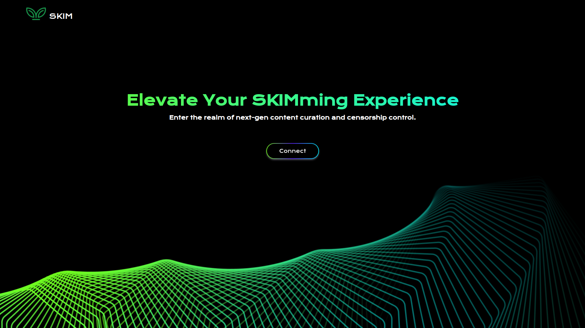
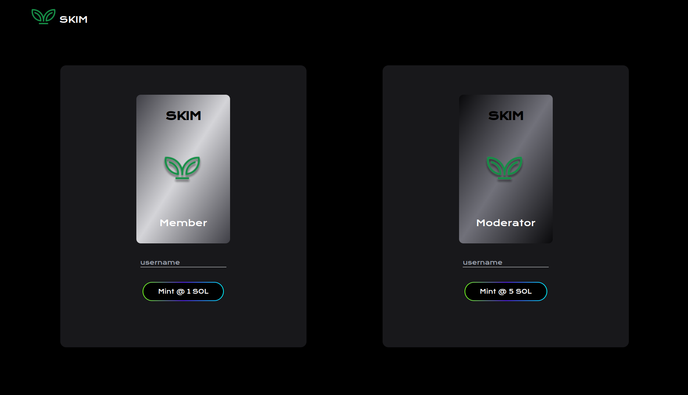

# SKIM

## Description

A platform where content is curated, moderated and managed by the members. A user can connect their Solana wallet to have a read-only view of the content available.
S/he can join us after minting an NFT, whether to become a Member (who can create posts) or to become a Moderator (who can delete a post or upvote posts to bring it to the top).

## Screengrabs

## Features

- Minting NFTs will cost few SOLs respective of the roles chosen.
- Moderators need to express why they want to be a moderator. The request comes to the backend to the admin to validate the request.
    This can later be converted to a DAO.
- Members can Post articles and comment on other articles.
- Moderators can delete posts and upvote posts to surface it on the top.

## Repos

Minting - https://github.com/encode-autumn-solana-bootcamp-2023-G2/sklim